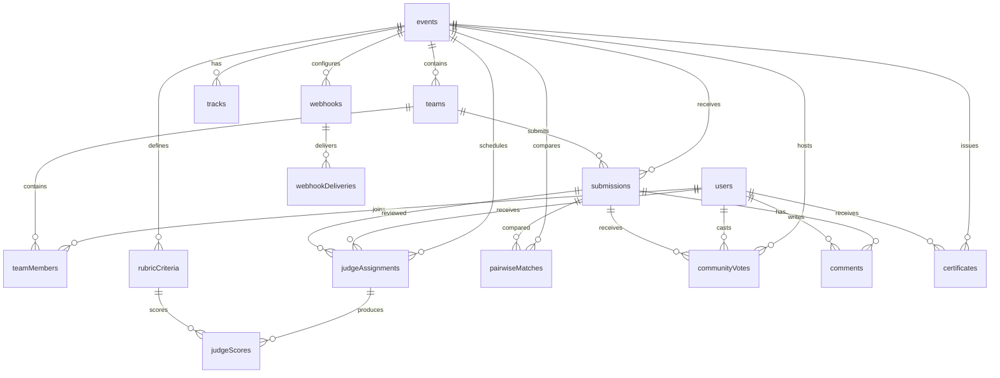

# Data Model

## Scope

The authoritative application schema is `src/convex/schema.ts`. It spreads `authTables` from `@convex-dev/auth/server`; those inherited authentication tables are package-owned and are not expanded in the local schema file. All other tables below are application-specific.

## Tables

| Table | Fields | Indexes and relationships |
|---|---|---|
| `users` | `email`, `name` required strings; `role`, `bio`, `avatarUrl`, `tokenIdentifier`, `totpSecret` optional strings; `totpEnabled` optional boolean; TOTP timestamps and `emailVerificationTime` optional numbers. | `by_token(tokenIdentifier)`, `by_role(role)`, `email(email)`. Referenced by teams, memberships, judges, votes, comments, audits, certificates, and webhooks through IDs. |
| `events` | Required slug/title/tagline/description/status strings; schedule and lifecycle timestamps; required timezone/settings strings; optional banner, organizer, host, short/full descriptions, rules, alternate schedule fields, team-size numbers, solo and cover-image booleans, and `publishedAt`. | `by_slug(slug)`, `by_organizer(organizerId)`. Parent of tracks, teams, submissions, criteria, assignments, scores, pairwise matches, votes, audit rows, webhooks, and certificates. |
| `tracks` | `eventId`, name, description, prizeDescription required; `prizeAmount` required number. | `by_event(eventId)`. Belongs to one event; submissions and teams may reference a track. |
| `teams` | `eventId`, name, inviteCode, createdBy required; optional `trackId`. | `by_event(eventId)`, `by_invite(inviteCode)`. Belongs to an event and creator; has many team members and may have submissions. |
| `teamMembers` | `teamId`, `userId`, `memberRole` required; `joinedAt` required number. | `by_team(teamId)`, `by_user(userId)`. Join table between users and teams. |
| `submissions` | Event/team IDs required; optional track ID; title, tagline, description, repository/video/demo URLs, tags, custom fields, status, and updated timestamp required; submitted timestamp optional. | `by_event(eventId)`, `by_team(teamId)`. Belongs to event and team; receives scores, comments, votes, and pairwise matches. |
| `rubricCriteria` | Event ID, name, description, weight, minScore, maxScore, sortOrder required. | `by_event(eventId)`. Criteria belong to one event and are referenced by judge scores. |
| `judgeAssignments` | Event, judge, submission IDs, status, assignedAt required; completedAt optional. | `by_event`, `by_judge`, `by_submission`. Connects judges to submissions. |
| `judgeScores` | Event, assignment, submission, judge, criterion IDs; score, privateNotes, submittedAt required. | `by_assignment`, `by_event`, `by_judge_submission`. Stores one judge's criterion score for an assignment. |
| `pairwiseMatches` | Event and judge IDs, two submission IDs, winnerId string, createdAt number. | `by_event`. Stores Bradley–Terry comparison data. |
| `communityVotes` | Event, user, submission IDs; points, creditsSpent, IP and user-agent hashes, createdAt required. | `by_event`, `by_user_event`, `by_submission`. Used for public voting and abuse controls. |
| `comments` | Submission and user IDs, content, isFlagged, createdAt required. | `by_submission`. Comments belong to submissions and authors. |
| `auditLogs` | Optional event and actor IDs; action, targetType, targetId, before/after state, IP address, previous hash, entry hash, timestamp required. | `by_event`, `by_action`. Append-only audit chain. |
| `webhooks` | Event ID, target URL, secret key, events string, active boolean, createdAt required. | `by_event`. Has many delivery rows. |
| `webhookDeliveries` | Webhook ID, event type, payload, status code, success, deliveredAt required. | `by_webhook`. Child delivery history. |
| `certificates` | UUID, event/user IDs, recipient, certificate type/title/track, rank, signature hash, issuedAt required. | `by_uuid`, `by_event`. Verifiable signed records. |
| `platform` | Key and value required strings. | `by_key`. Platform key/value storage. |

The inherited `authTables` are lookup and session-support tables owned by Convex Auth. They are not application lookup vocabularies. The application has no separate fixed-vocabulary table; lifecycle stages and roles are validated in code using string lists or Convex unions.

## Cascade and deletion behavior

The schema declares relationships but no database-level cascade rules. Deletion behavior is implemented in mutations. Draft event deletion is implemented in the source event mutation only for draft events; there is no general cascade routine documented in the schema. Team leave removes membership subject to leadership rules. Audit logs are append-only. Certificate issuance is idempotent rather than destructive. Any related-row cleanup not explicitly handled by a mutation is **not implemented**.

## Constraints enforced in code

Users cannot switch into protected roles without the role checks in `users.ts` and shared RBAC helpers. A participant may have only one team per event. Team creation and invite joining reject judges, enforce event existence, and enforce the configured maximum team size. Invite codes are indexed and generated as random hexadecimal values. Assignment planning prevents judges from reviewing their own teams, teammate teams, and shared-member conflicts. Score submission is restricted to assigned work and completed assignments cannot be reopened by the judge. Submission writes validate links, lengths, tags, and deadline/status conditions. Voting uses per-user event records, budgets, and hashed client signals. Webhook targets are validated against SSRF rules.

## Mermaid ER diagram

## Export and reset

Application CSV exports are implemented in `src/convex/exports.ts` for submissions, scores, rankings, assignments, and event JSON. A full database dump command is **not implemented** in the repository. Docker reset is destructive volume removal, normally performed with `docker compose down -v`, followed by `docker compose up --build`.

## References

[1]: src/convex/schema.ts "Convex schema"
[2]: src/convex/teams.ts "Team and invite constraints"
[3]: src/convex/judging.ts "Judge assignment and scoring constraints"
[4]: src/convex/submissions.ts "Submission validation and deadlines"
[5]: src/convex/lib/rbac.ts "Role authorization"
