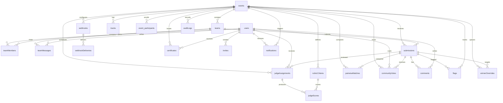

# Data Model

The authoritative schema is `src/convex/schema.ts`. It spreads
`authTables` from `@convex-dev/auth/server` (package-owned lookup/session tables,
not reproduced here) and defines **24 application tables**.

Convex has no migration files: pushing the function bundle *is* the migration, so
`schema.ts` is the single source of truth for every table and index below.

Legend: **R** = required, `?` = optional.

---

## Tables

### `users` — identity and role

| Field | Type | Notes |
|---|---|---|
| `email` **R** | string | unique in practice (`email` index) |
| `name` **R** | string | display name |
| `role` `?` | `"admin" \| "organizer" \| "judge" \| "participant"` | role is the basis of every authorization decision |
| `bio`, `avatarUrl`, `tokenIdentifier` `?` | string | `by_token` links a Convex Auth identity |
| `totpSecret`, `totpEnabled`, `totpEnrolledAt`, `totpLastVerifiedAt` `?` | sealed string / boolean / number | optional second factor for privileged roles |
| `emailVerificationTime` `?` | number | |
| `disabledAt`, `disabled_at` `?` | number | set by `users.adminDisable`; checked on every sign-in |

Indexes: `by_token(tokenIdentifier)`, `by_role(role)`, `email(email)`.

### `events` — the hackathon lifecycle

| Field | Type | Notes |
|---|---|---|
| `slug`, `title`, `tagline`, `description`, `status` **R** | string | `status` drives the stage machine: `draft → registration → hacking → judging → voting → published → closed → archived` (`hacking` is the submission window) |
| `registrationStart/End`, `submissionDeadline`, `judgingStart/End`, `votingStart/End` **R** | number | epoch ms, the enforcement source for every window check |
| `timezone`, `settings` **R** | string | `settings` is a JSON blob; exposed to clients via a masked projection |
| `organizerId` `?` | id(users) | owner; `by_organizer` powers "my events" |
| `bannerUrl`, `hostName`, `shortDescription`, `fullDescription`, `rules` `?` | string | presentation |
| `registrationOpens/Closes`, `submissionOpens`, `judgingStarts/Ends`, `resultsAnnounced` `?` | number | *legacy* duplicate schedule fields, still read as fallbacks (`judgingStart ?? judgingStarts`) |
| `minTeamSize`, `maxTeamSize`, `soloAllowed`, `coverImageRequired` `?` | number / boolean | team policy |
| `publishedAt` `?` | number | |
| `winnerOverrideProjectId` `?`, `winnerIsOverridden` `?` | id(submissions) / boolean | the project pinned to #1 and whether #1 came from an override rather than the computed ranking |

Indexes: `by_slug(slug)`, `by_organizer(organizerId)`.

> `draft` is not public: `events.get` / `events.getBySlug` throw for non-staff
> callers while the event is a draft, and `events.listPublic` filters drafts out.

### `tracks` — prize tracks

`eventId`(R), `name`(R), `description`(R), `prizeDescription`(R),
`prizeAmount`(R number). Index `by_event(eventId)`.

Track **names** are also the vocabulary judges' specialisations are validated
against (`judging.setJudgeTracks`).

### `teams` — team formation

`eventId`(R), `name`(R), `inviteCode`(R), `trackId`(?), `createdBy`(R).
Indexes `by_event`, `by_invite(inviteCode)`.

`inviteCode` is only returned to members and staff — `teams.listByEvent` nulls it
for everyone else.

### `teamMembers` — membership join table

`teamId`(R), `userId`(R), `memberRole`(R string), `joinedAt`(R number).
Indexes `by_team`, `by_user`. A user may hold at most one team per event
(enforced in `teams.create` / `joinByInviteCode`).

### `submissions` — participant work

`eventId`(R), `teamId`(R), `trackId`(?), `title`(R), `tagline`(R),
`description`(R), `repositoryUrl`(R), `videoUrl`(R), `demoUrl`(R), `tags`(R,
JSON array text), `customFields`(R, JSON), `status`(R: `draft | submitted`),
`submittedAt`(?), `updatedAt`(R). Indexes `by_event`, `by_team`.

Draft autosave writes `status: "draft"`; only `submitted` rows are judged,
gallery-listed, voted on, compared pairwise or flagged.

### `rubricCriteria` — the scoring rubric

`eventId`(R), `name`(R), `description`(R), `weight`(R number), `minScore`(R),
`maxScore`(R), `sortOrder`(R). Index `by_event`.

Weights must sum to 1.000; see [JUDGING.md](JUDGING.md#2-rubrics).

### `judgeAssignments` — who reviews what

`eventId`(R), `judgeId`(R), `submissionId`(R), `status`(R: `assigned |
in_progress | completed`), `assignedAt`(R), `completedAt`(?).
Indexes `by_event`, `by_judge`, `by_submission`.

Uniqueness is (`judgeId`, `submissionId`) — `runAssignment` de-duplicates before
inserting, and `sec.assignment_uniqueness` asserts the invariant on live data.

### `judgeScores` — one row per (assignment, criterion)

`eventId`(R), `assignmentId`(R), `submissionId`(R), `judgeId`(R),
`criterionId`(R), `score`(R number), `privateNotes`(R string),
`submittedAt`(R number). Indexes `by_assignment`, `by_event`,
`by_judge_submission(judgeId, submissionId)`.

`privateNotes` are readable only through staff-gated endpoints.

### `pairwiseMatches` — Bradley–Terry comparisons

`eventId`(R), `judgeId`(R), `submissionAId`(R), `submissionBId`(R),
`winnerId`(R string — empty string means a tie), `createdAt`(R).
Index `by_event`.

### `communityVotes` — public voting

`eventId`(R), `userId`(R), `submissionId`(R), `points`(R number),
`creditsSpent`(R number), `ipHash`(R — SHA-256 hex), `userAgentHash`(R),
`createdAt`(R). Indexes `by_event`, `by_user_event(userId, eventId)`,
`by_submission`.

`by_user_event` carries the per-user quadratic budget and the vote count;
`ipHash`/`userAgentHash` feed the Sybil burst heuristic (never raw IPs).

### `comments` — submission discussion

`submissionId`(R), `userId`(R), `content`(R, ≤ 2000 chars), `isFlagged`(R
boolean), `createdAt`(R). Index `by_submission`.

### `auditLogs` — hash-chained audit trail

`eventId`(?), `actorId`(?), `action`(R), `targetType`(R), `targetId`(R),
`beforeState`(R JSON), `afterState`(R JSON), `ipAddress`(R), `prevHash`(R),
`entryHash`(R), `timestamp`(R). Indexes `by_event`, `by_action`.

**Append-only.** `entryHash = H(prevHash ‖ action ‖ target ‖ states ‖ ts)`, so
editing or removing any row breaks every later hash; `audit.verifyChain`
re-computes the chain and reports the first mismatch.

### `webhooks` + `webhookDeliveries` — outbound integration

`webhooks`: `eventId`(R), `targetUrl`(R), `secretKey`(R, ≥ 64 chars),
`events`(R, comma-separated types), `isActive`(R boolean), `createdAt`(R).
Index `by_event`.

`webhookDeliveries`: `webhookId`(R), `eventType`(R), `payload`(R JSON),
`statusCode`(R), `success`(R boolean), `deliveredAt`(R). Index `by_webhook`.

Delivery is signed with HMAC-SHA256 over the payload plus a timestamp and a
nonce; targets are validated against SSRF rules and the RFC-1918/loopback
allowance documented in [THREAT-MODEL.md](THREAT-MODEL.md).

### `certificates` — verifiable credentials

`certUuid`(R), `eventId`(R), `userId`(R), `recipientName`(R), `certType`(R),
`title`(R), `trackName`(R), `rank`(R number), `signatureHash`(R),
`issuedAt`(R). Indexes `by_uuid`, `by_event`.

Issuance is **idempotent**: the `(eventId, userId, certType)` tuple is checked
first, so re-running the batch does not mint duplicates.

### `platform` — key/value store

`key`(R), `value`(R). Index `by_key`.

This table plays three roles, distinguished by key prefix:

| Prefix | Contents |
|---|---|
| *(none)* / plain | operator settings (`cert_secret`, seed flags, the four branding keys, and the stored-but-unenforced preference keys) |
| `session:` | `session:<sha256(token)>` → user id, for the REST session-cookie path |
| `ratelimit:` | fixed-window counters: `ratelimit:<bucket>` (votes/comments), `ratelimit:auth:<sha256(email)>` (sign-in/sign-up attempts) |
| `lookup:` | reference vocabularies (JSON) |
| `invite:` | invite token hashes |
| `judge_tracks:` | `judge_tracks:<userId>` → JSON array of track names |
| `rubric_lock:` | `rubric_lock:<eventId>` → `"locked" \| "unlocked"` |

Of the plain keys, only the four branding keys (`site_name`, `site_tagline`,
`logo_url`, `footer_copyright`) are read by the app; they are served by the
allowlisted `branding.getBranding` query. The rest of the preferences
`/admin/settings` writes are stored and audit-logged but not enforced — the page
labels them as such, and the gap is listed in [README.md](README.md#known-gaps).

Secrets are stripped by a projection (`admin.projectPublicSettings`) before any
of it reaches a client, and `sec.platform_secrets` asserts that on live data.

### `invites` — role invitations

`email`(?), `role`(R), `eventId`(?), `tokenHash`(R), `createdBy`(R),
`createdAt`(R), `expiresAt`(R), `usedAt`(?), `revokedAt`(?).
Indexes `by_token_hash`, `by_email`.

Only the **hash** of the token is stored; the plaintext is shown once at creation.
`admin.acceptInvite` rejects expired, used and revoked invites.

### `event_participants` — enrollment

`eventId`(R), `userId`(R), `status`(R), `lookingForTeam`(?), `createdAt`(R).
Indexes `by_event`, `by_user`, `by_event_user`.

`by_event_user` makes "is this user enrolled in this event" a single indexed
lookup, and `lookingForTeam` powers team-matchmaking surfaces.

### `flags` — duplicate / moderation flags

`submissionId`(R), `eventId`(R), `reason`(R), `severity`(?),
`status`(R: `open | dismissed | removed`), `createdAt`(R), `reviewedAt`(?).
Indexes `by_submission`, `by_event`.

`severity` is `"duplicate"` (same team) or `"review"` (a repository URL shared
across teams, which is a hint rather than a rule).

Written by the duplicate detector and by comment reporting; reviewed through the
organizer duplicates tab.

### `teamMessages` — private team chat

`teamId`(R), `userId`(R), `content`(R, ≤ 2000 chars),
`fileStorageId`(?), `fileName`(?), `fileType`(?), `createdAt`(R).
Index `by_team`.

Reads and writes both resolve membership server-side and refuse staff, so an
organizer cannot read a team's channel.

### `winnerOverrides` — the #1 override queue

`eventId`(R), `requestedBy`(R), `requestedAt`(R), `targetProjectId`(R),
`reason`(R), `status`(R: `pending | accepted | rejected`), `source`(?:
`organizer_request` | `admin_direct`), `reviewedBy`(?), `reviewedAt`(?),
`reviewerNote`(?), `appliedAt`(?). Indexes `by_event`, `by_status`, `by_target`.

An organizer request is queued for admin approval; an admin can act directly.
Accepting one writes `events.winnerOverrideProjectId` and re-ranks the event —
the override is recorded, not silent.

### `notifications` — the per-user feed

`userId`(R), `type`(R machine-readable kind, e.g. `results_published`),
`eventId`(?), `message`(R), `linkUrl`(?), `createdAt`(R), `readAt`(?).
Indexes `by_user`, `by_user_unread(userId, readAt)` — the shell's bell reads the
second one, so "unread" is one indexed lookup rather than a scan.

### `helpContent` — seeded help centre

`type`(R: `faq` | `article`), `title`(R), `body`(R), `order`(R), `visible`(R),
`createdAt`(R), `updatedAt`(R), `createdBy`(?). Index `by_type`.

Five entries ship with the seed; `/admin/help` edits them. `faq` rows render in
the accordion, `article` rows in the article list.

---

## Relationships



---

## Cascade and deletion rules

Convex declares no database-level cascades. Every cascade is explicit in a
mutation, and each one is audited:

| Deleting | Cascades to | Where |
|---|---|---|
| a **draft event** | nothing (only drafts are deletable) | `events.deleteEvent` |
| a **user** (admin) | account disabled/removed; owned content is retained for audit | `users.adminDelete` |
| a **flagged submission** | its `judgeAssignments` are withdrawn and deleted; the flag is marked `removed` | `submissions.removeFlaggedSubmission` |
| **all assignments for an event** | replaced wholesale on the next `runAssignment` | `judging.runAssignment` |
| a **team member** | membership row only; leadership transfer is explicit and must not orphan the team | `teams.leave`, `teams.transferLeadership` |
| **judge scores** | never deleted; a completed assignment cannot be re-opened by a judge | `judging.submitScores` |

Audit rows are never deleted. Certificate issuance is idempotent rather than
destructive.

---

## Constraints enforced in code

- **Roles** — `requireUser` / `requireRole` / `requireOrganizer` in
  `src/convex/lib/common.ts`; see the matrix in [JUDGING.md](JUDGING.md#7-role-isolation).
- **One team per participant per event**, validated on both create and join.
- **Judges are rejected** by team creation and invite join.
- **Invite codes** are random hex, lower-cased and trimmed on comparison.
- **Deadline/window** — `assertSubmissionWindow`, `assertWithinWindow`,
  `stageAllows*` in `lib/timeWindows.ts` and `lib/common.ts`.
- **Assignment** — no self-team, teammate-team or shared-member conflicts; no
  duplicate (judge, submission) pairs; hard per-judge cap.
- **Rubric** — weights sum to 1.000 (±0.001), unique-per-submission criteria,
  score within `[minScore, maxScore]`, immutable once locked.
- **Pairwise** — both sides belong to the event and are submitted; the winner must
  be one of the two competitors.
- **Voting** — per-user budget, one vote per submission in upvote mode, quadratic
  credit accounting, rate limit, hashed client fingerprints.
- **Rate limits** — fixed window in the `platform` table, shared by votes,
  comments and credential attempts.
- **Webhook targets** — scheme and SSRF validation before any request.
- **Submissions** — link scheme validation, length bounds, tag limits, and
  duplicate title/repo detection on submit.

---

## Export and reset

`src/convex/exports.ts` serves CSV for submissions, scores, rankings and
assignments, plus a full event JSON. CSV column sets are stable but unversioned
(see the known gaps in [README.md](README.md)).

There is **no** `db:dump` command in the repository. Back up PostgreSQL directly:

```bash
docker compose exec -T db pg_dump -U dogfood dogfood > backup.sql
```

Reset destroys the volumes and re-seeds:

```bash
docker compose down -v && docker compose up --build
```
