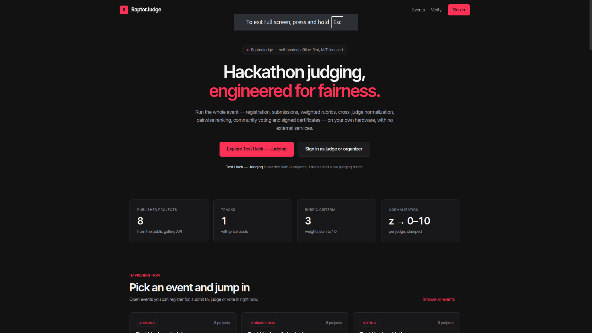
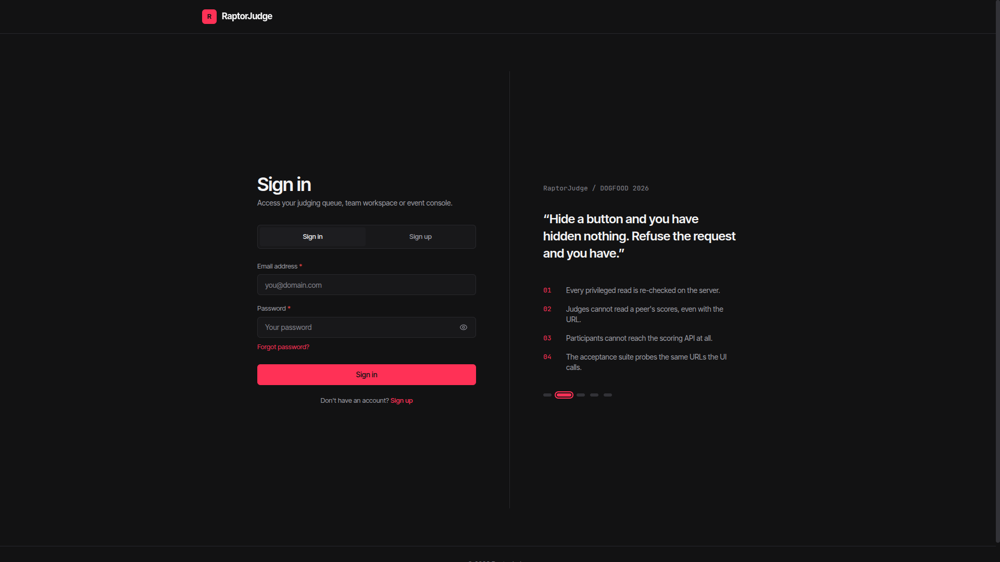
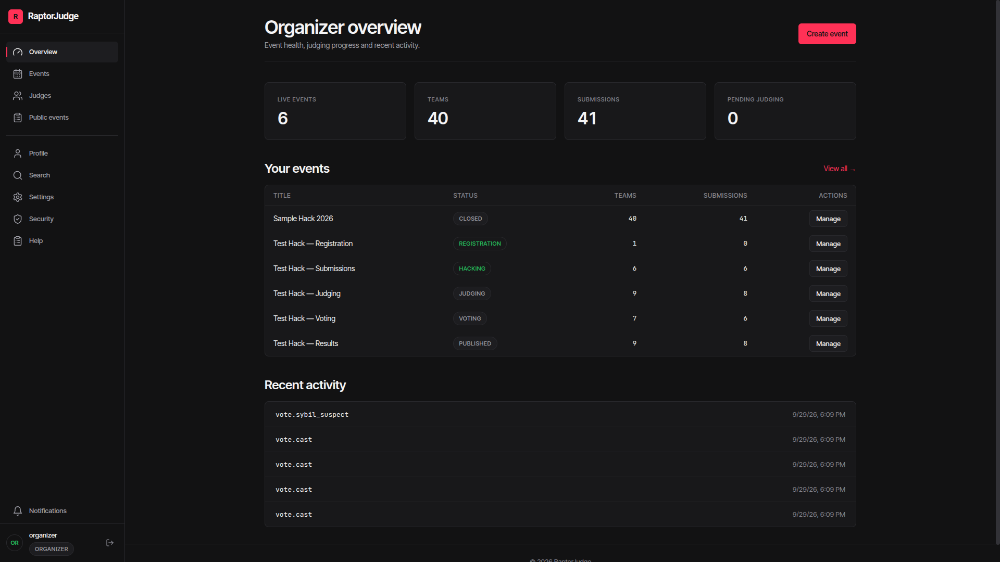
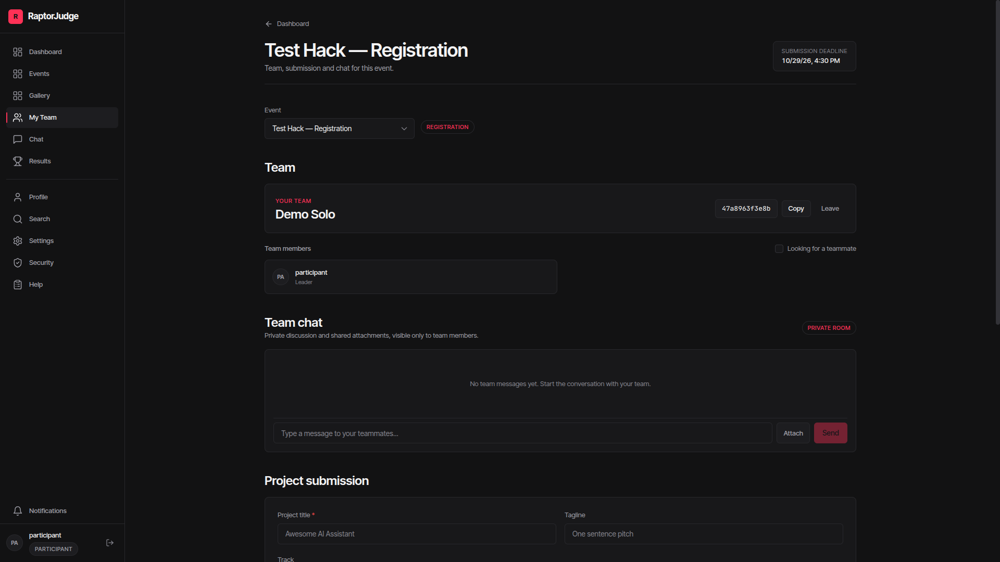
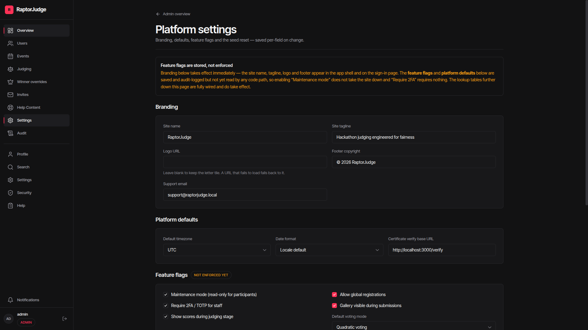

# RaptorJudge

**Self-hosted hackathon submissions and judging — weighted rubrics, cross-judge score normalization, Bradley–Terry pairwise ranking, community voting, a hash-chained audit log and verifiable certificates, all offline on your own hardware.**

[](#acceptance-status)
[](#license)

> **Docs verified against `main` on 2026-09-29.** Every number in this file has a
> command beside it — if a count ever disagrees with the code, the code wins.
> [FINAL-REVIEW.md](FINAL-REVIEW.md) is the ledger of what is proven by which
> command, and the `AUDIT*.md` files are historical snapshots.

---

## Verify in 5 minutes

```bash
git clone https://github.com/Parshv-collab/raptorjudge
cd raptorjudge
docker compose up --build
```

Wait for the four containers to come up. Then:

```bash
python3 run.py .dogfood.toml          # T1/T2 acceptance → 7/7 PASS
python3 run_t3_t4.py .dogfood.toml    # T3/T4 self-audit → 17/17 PASS
```

Open <http://localhost:3000>. Sign in with any seeded account — the password is
**`dogfood2026`** for all of them:

| Role | Email |
|---|---|
| Admin | `admin@fixture.local` |
| Organizer | `organizer@fixture.local` |
| Judge A | `tomas.varga@example.org` |
| Judge B | `wei.lindqvist@example.org` |
| Participant | `participant@fixture.local` |

No signup, no mail server, no API keys, no external services. The first boot
seeds a deterministic population — 8 tracks, 30 judges, 40 teams, 41 projects,
126 score rows — so every screen opens with real data instead of an empty state.
[What happens on first boot](#what-happens-on-first-boot) walks the sequence;
[Seeded credentials](#seeded-credentials) says what each account unlocks.

## What you'll see

### Landing page



### Sign-in



### Organizer console



### Participant workspace



### Platform settings



> **Demo:** no video — the screenshots above and the verification scripts below
> are the demo. Every claim in this README is a command you can run.

---

## What it is

RaptorJudge runs a hackathon end to end: registration, team formation with invite
codes, deadline-enforced submissions, a public gallery, weighted rubric judging,
normalization that removes harsh/lenient judge bias, pairwise comparison ranking,
community voting with hidden tallies, CSV/JSON export, signed certificates, and a
tamper-evident audit trail of every privileged write.

It is designed to be **adopted, not demoed**: one `docker compose up` produces a
working event with a deterministic fixture population you can immediately sign
into as an admin, organizer, two judges and a participant.

## Stack

| Layer | Choice |
|---|---|
| Frontend | React 18.3, TypeScript 5.9, Vite 5, React Router 6, Tailwind CSS 3 |
| UI | No component library — a hand-rolled design system over Radix-free primitives. `lucide-react` icons, `recharts` for the results charts, `react-markdown` + `remark-gfm` for user-authored text, `sonner` toasts. Motion is CSS transitions only; there is **no** animation library |
| Fonts | `@fontsource-variable/inter-tight` + `jetbrains-mono`, bundled at build time (no CDN) |
| Backend | Self-hosted [Convex](https://convex.dev) 1.46 (typed DB + queries/mutations/actions + HTTP actions) |
| Auth | `@convex-dev/auth` 0.0.95 password provider, RS256 session JWTs, optional TOTP for privileged roles |
| Database | PostgreSQL 16 (Convex storage backend) |
| Serving | nginx (SPA + security headers) behind Docker Compose |
| Tests | Vitest 2.1 — 258 unit tests / 21 files · Playwright 1.63 — 49 browser tests / 7 specs · two Python HTTP harnesses (7/7 and 17/17) |

There is no Express/Fastify/Django service, no UI component library and **no
runtime third-party API requirement**. Everything runs inside the Compose stack.

## What happens on first boot

> **Suggested walkthrough:** sign in as the organizer on `test-hack-results`,
> then as a judge score a submission, then as the participant show the podium
> and a verified certificate.

The clone and `docker compose up --build` from
[Verify in 5 minutes](#verify-in-5-minutes) bring up the stack on
**<http://localhost:3000>**. Internally:

1. `db` (PostgreSQL 16) starts and passes its healthcheck.
2. `backend` (Convex) starts with `POSTGRES_URL` pointing at `db` and answers
   `/version` once it is healthy.
3. `dashboard` (Convex Dashboard, port 6791) starts and waits for the backend.
4. `admin_key` asks the backend to mint its function-push admin key and writes it
   to a shared volume.
5. `bootstrap` takes that key, publishes the Convex Auth signing keys, pushes
   `src/convex` as the schema/function migration, and runs the fixture seed. It
   exits when done.
6. `frontend` builds the Vite bundle and serves it through nginx on port 3000.

A fresh clone requires no manual steps. On first boot, the
bootstrap generates a Convex admin key and prints it to the log.
To persist the key across `docker compose down -v`, copy it into
.env as `CONVEX_SELF_HOSTED_ADMIN_KEY`.

> The key is minted **by the backend process**, not derived from
> `INSTANCE_SECRET`, which is why it cannot simply be a template variable. If
> you already have a key, setting it in `.env` skips step 3 entirely.

The seed is **idempotent** (`fixture-seeded-2026` flag) and deterministic. If you
need to start from scratch, see [Resetting](#resetting-the-data).

> Deployment to a LAN IP or a real domain without rebuilding the image, plus the
> runtime URL variables (`CONVEX_URL`, `CONVEX_CLOUD_ORIGIN`,
> `CONVEX_SITE_ORIGIN`, `TRUSTED_ORIGINS`), is covered in
> [docs/DEPLOY.md](docs/DEPLOY.md) and `env.example`.

### Local development (no Docker)

```bash
npm install
npm run dev            # Vite dev server
npx convex dev --once  # codegen + push functions to your local deployment
```

`bun install && bun run dev` works too — both lockfiles are kept in sync for the
Docker path (`npm ci`) and local work.

## Seeded credentials

All demo accounts use the password **`dogfood2026`**. These are the accounts the
seed *actually creates* in `src/convex/seed.ts`.

| Role | Email | What it unlocks |
|---|---|---|
| Admin | `admin@fixture.local` | Audit chain, rubric unlock, role management, invites, settings |
| Organizer | `organizer@fixture.local` | Event management, rubric, assignments, results, exports, webhooks |
| Judge A | `tomas.varga@example.org` | Own scoring queue; **blocked** from Judge B's scores |
| Judge B | `wei.lindqvist@example.org` | Own scoring queue; used to demonstrate peer isolation |
| Participant | `participant@fixture.local` | Team workspace, submission, chat, certificates |

The seeded event is **`sample-hack-2026`** ("Sample Hack 2026"):

- public event page: `/e/sample-hack-2026`
- public gallery: `/gallery/sample-hack-2026`
- organizer console: `/organizer/events/sample-hack-2026`
- embeddable widget: `/embed/gallery/sample-hack-2026`

Fixture population (from `fixtures.json`, seeded verbatim): **8 tracks, 30 judges,
40 teams, 41 projects, 126 score rows.** On top of the fixtures the seed adds demo
community votes, pairwise comparisons, certificates, and runs the duplicate
detector once — so the voting, pairwise and certificate screens all open with real
material instead of empty states.

The login page does **not** embed these credentials and prefills nothing — type
the email and `dogfood2026`. Every seeded account is created with that one
password (`SEED_PASSWORD` in `src/convex/seed.ts`); there is no "any password
will do" shortcut.

Sign-in is throttled: **20 attempts per 5 minutes per address** (keyed by
`sha256(email)`), and successful attempts count too. Retyping credentials in a
loop therefore ends with "Too many attempts for this email. Wait a few minutes
and try again." rather than a session. The same accounts back the Playwright
suite, so leave a minute between full runs.

## Seeded events

The seed always creates **one** event:

| Event | Slug | Stage | Demonstrates |
|---|---|---|---|
| Sample Hack 2026 | `sample-hack-2026` | `closed` | The full fixture population: 8 tracks, 30 judges, 40 teams, 41 projects, 126 score rows, plus demo votes, pairwise matches, certificates and a duplicate flag. This is the event the acceptance suite targets, and it is never modified by anything below. |

Setting **`TEST_EVENTS=true`** additionally seeds five demo events, each frozen
in a different lifecycle stage with its own dates computed from the moment the
seed runs, so every write-side flow can be exercised without waiting for real
time to pass or hand-editing dates:

| Event | Slug | Stage | Contents |
|---|---|---|---|
| Test Hack — Registration | `test-hack-registration` | `registration` | 0 projects, 0 judges, 0 votes — sign-ups are open, nothing built yet |
| Test Hack — Submissions | `test-hack-submissions` | `hacking` | 5 projects, 0 judges, 0 votes — teams are submitting against a live deadline |
| Test Hack — Judging | `test-hack-judging` | `judging` | 8 projects, 3 judges assigned, 4 scored — a partially filled judging queue |
| Test Hack — Voting | `test-hack-voting` | `voting` | 6 projects all scored, 15 votes — community voting open, tallies hidden |
| Test Hack — Results | `test-hack-results` | `published` | 8 projects all scored, 30 votes, winner crowned, certificates issued |

### Moving an event through its stages

The seven stages are a line — `draft → registration → hacking → judging →
voting → published → archived` — and the console's **Overview** tab carries a
Lifecycle picker listing exactly the transitions the server accepts (both read
the same policy module, `src/lib/eventLifecycle.ts`). Two rules matter:

- **An organizer moves forwards freely and may step back one phase.** Stepping
  back further is refused by name: reopening registration from the middle of a
  judging week would re-open a gate people have already passed through.
- **Published results are not walked back by anyone.** The organizer's header
  button disappears entirely once results are out — it is not disabled with a
  tooltip, it is absent, because "announce a winner, then quietly un-announce
  them" is not a workflow. A genuine mistake (wrong rubric, unscored
  assignments) is recovered by an administrator on `/admin/events` through
  **Retract results**, which demands a written reason, returns the event to
  community voting, revokes the event's certificates in place (verification then
  reports them invalid rather than losing them) and records everything in the
  audit chain.

Deadline edits follow the same asymmetry: moving a registration or submission
deadline **later** is always allowed, moving it **earlier** is refused once
teams or submissions exist.

**`participant@fixture.local` is enrolled in all five.** The main seed creates
that account but never puts it on a team, which left the participant role's
whole journey — workspace, team chat, vote panel, comments, results — empty on
a `TEST_EVENTS` stack. It is now a solo member of `Demo Solo` in the
registration event and leads `Demo Crew` (with `member1_1@example.org`, so team
chat has two real accounts) in the other four, and it holds a draft project in
the submissions event. This happens in the `TEST_EVENTS` branch only: Sample
Hack 2026 and the acceptance suite are untouched. Its 15 seeded votes in the
voting event come from other accounts, so signing in as it still opens a full,
untouched ballot.

**The five test events only appear when `TEST_EVENTS=true`.** The default is
`false`, and with it the seed behaves exactly as before — only Sample Hack 2026
is created, and the landing page shows the single-event layout it always had.

Everything is built from the existing fixture users, teams, judges and projects;
no new accounts are invented. All writes go through the same internal mutations
the regular seed uses, and every vote is recorded in the hash-chained audit log.

To switch modes:

```bash
# docker path: edit TEST_EVENTS in .env, then
docker compose up --build     # the bootstrap container publishes the flag to the deployment

# local dev: the Convex deployment's env vars are what the functions read
bun convex env set TEST_EVENTS true
bun run seed
```

It is idempotent — a `test-events-v1` platform flag guards re-runs, so the flag
can be turned on after the first boot without wiping the fixtures. Turning it
back off stops the events being created but leaves already-seeded rows in place;
a fresh seed (`docker compose down -v`, or clearing the seed flags) is how you go
back to a single-event deployment.

## Acceptance status

| Tier | What it covers | Verified by | Status |
|---|---|---|---|
| **T1** | Public gallery, fixture content, deadline lock | `python3 run.py .dogfood.toml` | ✅ verified |
| **T2** | Judge isolation (own vs peer scores), CSV export | `python3 run.py .dogfood.toml` | ✅ verified |
| **T3** | Community voting, comments & flagging, hidden results, deterministic ballots, rate limiting, duplicate detection, audit chain | `python3 run_t3_t4.py .dogfood.toml` | ✅ self-audited (9/9) |
| **T4** | OpenAPI + REST, signed webhooks, verifiable certificates and judge records, embed widget, bulk export/import | `python3 run_t3_t4.py .dogfood.toml` | ✅ self-audited (8/8) |

Counts, as captured in `acceptance-report.txt` and `t3-t4-audit.txt`:

| Tier | Verified by | Result |
|---|---|---|
| T1 | `run.py` | 3/3 PASS |
| T2 | `run.py` | 4/4 PASS |
| T1 + T2 combined | `run.py` | **7/7 PASS** |
| T3 | `run_t3_t4.py` | 9/9 PASS |
| T4 | `run_t3_t4.py` | 8/8 PASS |
| T3 + T4 combined | `run_t3_t4.py` | **17/17 PASS, 0 skips** |

> `run.py` reports one combined **7/7** for T1 and T2 — the 7 is the sum of the
> two tiers (3 + 4), not a per-tier figure, so it is not repeated on both rows.

> The official `run.py` only checks **T1 and T2**. Running it alone prints
> `claimed T1 T2 T3 T4, verified T1 T2`, which reads as though T3 and T4 were
> unverified. `run_t3_t4.py` is the companion that closes that gap — see
> [Verifying T3 and T4](#verifying-t3-and-t4).

`run.py .dogfood.toml` against the running stack reports **7/7** — the captured
output is in [`acceptance-report.txt`](acceptance-report.txt):

```
T1  gallery is public ................. PASS
T1  project from fixtures shown ....... PASS
T1  closed event refuses submissions .. PASS
T2  judge sees own scores ............. PASS
T2  judge cannot see peer scores ...... PASS
T2  participant blocked ............... PASS
T2  csv export works .................. PASS
```

### Verifying T3 and T4

The official checker ships only the T1/T2 tiers, so this repository also carries
a T3/T4 self-audit. It reads the same `.dogfood.toml` (so it inherits your
`[portal]`, `[auth]` and `[routes]` settings), needs nothing but the Python
standard library, and drives the running portal over real HTTP:

```bash
python3 run_t3_t4.py .dogfood.toml
```

The captured run is checked in as [`t3-t4-audit.txt`](t3-t4-audit.txt):

```
DOGFOOD 2026 — T3/T4 self-audit report
portal: http://localhost:3000
fixtures: fixtures.json
event: test-hack-voting (voting)

T3  Community voting works (credits round-trip) .. PASS
T3  Quadratic credit spend (cost = N²) ........... PASS
T3  Comments add/delete .......................... PASS
T3  Comment flagging ............................. PASS
T3  Results hidden before publish ................ PASS
T3  Ballot order deterministic ................... PASS
T3  Rate limiting fires .......................... PASS
T3  Duplicate detection (3-of-3 rejected) ........ PASS
T3  Audit chain verifies ......................... PASS
T4  OpenAPI spec responds ........................ PASS
T4  REST endpoints respond ....................... PASS
T4  Webhook delivery signed ...................... PASS
T4  Certificates verify .......................... PASS
T4  Judge records verify ......................... PASS
T4  Embed gallery renders ........................ PASS
T4  Bulk export works ............................ PASS
T4  Bulk import idempotent ....................... PASS

Summary: 17/17 PASS
```

**There are zero skips.** [`t3-t4-audit.txt`](t3-t4-audit.txt) is the verbatim
capture, including the evidence line under each check.

The `event:` line is whichever event the script auto-discovers with an open
judging or voting window, so it differs per deployment (`test-hack-voting` and
`test-hack-judging` on a stack seeded with `TEST_EVENTS=true`).

A check is reported as **PASS only when real evidence proves it**. Sixteen of
the seventeen make a real HTTP request and inspect the response and side
effects; the seventeenth (duplicate detection) is described below. When even
that is impossible — no event is open for judging or voting, or the `[auth]`
section is missing the session a check needs — the check is reported as **SKIP
with its reason**, and skipped checks are excluded from the pass count. Nothing
is ever reported as verified because it had nothing to test.

Three checks needed care to stay honest rather than report a comfortable pass:

- **Rate limiting (T3.7).** The limiter is per actor+event, not per project, so
the check fires 25 one-point votes at a *single* submission instead of one vote
across 25 projects. It then proves the refusal came from the limiter and not
from the quadratic budget — the `400` arrives while fewer than the 25 wall
credits are spent. (The REST bridge sanitizes thrown mutation errors to
`400 {"error":"request failed"}` on purpose, so the limiter's message, and a tidy
`429`, are not visible over HTTP; the credit arithmetic is what makes the
attribution safe. It also asserts the accepted votes are counted one-for-one and
the credits are fully restored on revoke.) The one-minute window is then waited
out, so the deployment is left usable and a second run behaves identically.
- **Duplicate detection (T3.8).** No HTTP route creates submissions: `POST
/api/submissions` is a contract check against the closed `sample-hack-2026`
event and inserts nothing, so a 3-of-3 duplicate cannot be *filed* over the
wire on any deployment. The check instead runs `tests/duplicates.test.ts`, the
suite that covers the rule the Convex write path actually calls
(`src/lib/algorithms/duplicates.ts`), and passes only when the 3-of-3 write
decision and the exact `"This project is already submitted by your team."`
message are proven green. If a runner **is** available but the suite does not
prove those assertions, it reports **FAIL** — not SKIP — because a broken write
path must not look like an untested one. If the host has **no** test runner at
all (neither `bun` nor `node`/`npm`), it reports **SKIP** with that reason,
because a missing toolchain is a property of the machine, not a verdict on the
rule. Runners are tried in the order `bun` → `bunx` → `npx`; the `npx` attempt
uses `--no-install` so an offline host fails in seconds instead of hanging while
npx offers to download vitest.
- **Webhook delivery (T4.3).** The delivery `fetch` runs inside the backend
container, where `127.0.0.1` is the container's own loopback, so the receiver
listens on every interface and the deployment is given an address it can reach:
`host.docker.internal` (Docker Desktop natively; Linux via the additive
`extra_hosts: - "host.docker.internal:host-gateway"` entry on the `backend`
service in `docker-compose.yml`), then `172.17.0.1` (the docker0 bridge), then
`127.0.0.1` for a non-Docker local deployment. Set `RAPTORJUDGE_WEBHOOK_HOST` to
override the list. Each candidate is tried in turn; the first delivery is
verified as HMAC-SHA256 over `timestamp.delivery.body` **and** checked to be the
`ping` that was triggered. If no candidate delivers, the check reports FAIL with
the addressing it tried — a deployment whose containers cannot reach the host is
a real finding, not an untestable corner.

Both suites are complemented by the in-app acceptance suite, runnable as an
organizer from `POST /api/v1/acceptance` or from the Acceptance panel on the
organizer dashboard. It reports two different batteries and the counts are not
interchangeable:

| Surface | Tier checks | T5 security checks | Total |
|---|---|---|---|
| `POST /api/v1/acceptance` (REST bridge) | 8 | 17 | **25** |
| Acceptance panel (in-app mutation) / `npm run acceptance` | 17 tier + 2 bonus | 17 | **36** |

The in-app battery is the wider of the two: T1 ×6, T2 ×5, T3 ×4, T4 ×2, BONUS ×2. A
clean seeded deployment reports `36/36 checks passed`; re-measure it any time with
`npm run acceptance` (needs `VITE_CONVEX_URL` pointed at a seeded deployment and
the seeded organizer password, `dogfood2026`).

The T5 battery is shared, so both agree on it: JWT forgery, open redirects,
webhook replay and target validation, assignment and score uniqueness,
certificate idempotency, MFA secret sealing and role scope, link schemes,
input bounds, platform-secret projection, duplicate flagging, load cap and
rubric weights. Skipped checks (a check with nothing to evaluate) are reported
and **excluded from the pass count** on both surfaces — a check that reports
success because it had no input is a fail-open check, not a pass.

## Feature matrix

| Tier | Surface | Status |
|---|---|---|
| **T1 Core** | Four-role auth with sessions, TOTP for privileged roles, event lifecycle state machine, tracks + prizes, teams + invite codes, draft autosave, strict deadline lock, public gallery, comments | Complete |
| **T2 Judging** | Load-balanced conflict-aware assignment with a per-judge cap and track affinity, assignment **preview** (dry run), weight-validated rubrics that **lock** when judging starts, isolated judge queues, per-criterion scoring with localStorage draft autosave, scores that lock on submit, "you've scored N of M" progress, z-score normalization (0–10), Bradley–Terry pairwise ranking, CSV/JSON exports | Complete |
| **T3 Public** | Plain + quadratic community voting with hidden tallies, comment moderation (flag/unflag/delete), seeded-randomized gallery ordering, rate limiting (votes + comments), team-scoped duplicate detection (same team: title, repo URL, or both — a repo shared across teams is a review-only flag) with organizer review, hash-chained audit log with chain verification | Complete |
| **T4 Stretch** | REST API + OpenAPI 3.0.3 document at `/api/openapi.json`, HMAC-SHA256 signed webhooks with replay protection, certificates with public verification, signed judge records, embeddable gallery widget, bulk JSON import/export | Complete |
| **Bonus** | Normalization proof regenerated from fixtures, Bradley–Terry MM ranking, STRIDE threat model, API-first design | Complete |

## Testing

Four layers, each answering a question the others cannot.

| Layer | Command | What it covers |
|-------|---------|----------------|
| Unit + integration | `npm test` | Backend logic, algorithms, security, audit chain (258 tests, 21 files) |
| **E2E (browser)** | `npm run test:e2e` | **React pages, sign-in flows, role guards, admin nav** (49 tests, 7 specs) |
| T1/T2 acceptance | `python3 run.py .dogfood.toml` | Official checker |
| T3/T4 self-audit | `python3 run_t3_t4.py .dogfood.toml` | Self-audit |
| Compose smoke | `npm run docker:verify` | Boots the real stack and asserts health + API surface |

The unit and HTTP layers are fast and hermetic but they never render a React
page: a broken import, a component that throws on mount, or a route that no
longer exists passes all 258 unit tests and both Python suites, and only fails
in a browser. The Playwright layer closes that gap.

**E2E tests require the stack to be running:**

```bash
docker compose up -d
npx playwright install chromium     # once per machine
npm run test:e2e
```

Point the suite at another host with `E2E_BASE_URL=https://…`. Run a single spec
with `npx playwright test e2e/judge.spec.ts`, or browse them interactively with
`npm run test:e2e:ui`. Traces and screenshots are written to `test-results/` on
failure and are gitignored.

The suite signs in with the seeded accounts from
[Seeded credentials](#seeded-credentials) (password `dogfood2026`) and runs
**serially with one worker** — the app rate-limits per user+event, and several
specs reuse the same accounts, so parallel workers would trip the limiter
against each other.

Each account authenticates **once per run**: `e2e/helpers.ts` types the
credentials into the real form the first time, then replays the issued JWT into
the next page's `sessionStorage`. `auth.ts` charges every credential attempt —
successful ones included — against a per-address bucket of 20 per 5 minutes, so
signing in afresh per test made the suite pass on a clean stack and then fail
inside that window. The message it shows is the throttle's own — “Too many
attempts for this email. Wait a few minutes and try again.” — because every auth
error is routed through `describeSignInFailureForUser`
(`src/convex/lib/signInErrors.ts`) rather than a generic failure string. The specs
that are *about* the sign-in form still use the real form every time
(`signInViaForm`); nothing is cached for them.

Two notes on what the suite does and does not assert:

- The five `Test Hack — …` demo events only exist when the stack was seeded with
  `TEST_EVENTS=true`. `e2e/admin.spec.ts` **detects** which deployment it is
  looking at rather than taking an env var, so the same command is correct
  against both: on a single-event stack it asserts their absence, on a staged
  one it asserts they are all there. It also means no `E2E_TEST_EVENTS` to
  remember — which was previously a way to fail the suite by forgetting it.
- Assertions never name the *featured* event. `events.featuredForVisitors` ranks
  open events (registration/hacking/judging/voting) by team count first and only
  falls back to the closed bucket when there are none, so the featured card is
  `Sample Hack 2026` on a default stack and a currently-open demo event on a
  `TEST_EVENTS=true` one. The suite asserts a real card is rendered, not which
  event won.
- `participant@fixture.local` is created by the seed but, on a **default
  (single-event) stack**, is deliberately never added to a team — so its
  dashboard shows the "You're not enrolled in any events yet" empty state. The
  enrolled-events spec therefore signs in as a real fixture team member
  (`priya1@example.org`) instead. On a `TEST_EVENTS=true` stack that account is
  enrolled in all five demo events and the dashboard spec asserts the wider set;
  the self-vote spec is the one that skips itself when the demo events are
  missing.

## Commands

| Command | Purpose |
|---|---|
| `npm run dev` | Vite dev server (frontend) |
| `npm run build` | Production build to `dist/` |
| `npm run typecheck` | `tsc -b --noEmit` (covers `src/`, `tests/`, `e2e/`, `playwright.config.ts`) |
| `npm test` | Vitest suite (258 tests, 21 files) |
| `npm run test:e2e` | Playwright browser suite (49 tests, 7 specs) — needs a running stack |
| `npm run test:e2e:ui` | Playwright interactive mode |
| `python3 run_t3_t4.py .dogfood.toml` | T3/T4 self-audit against a running stack |
| `npm run test:watch` | Vitest in watch mode |
| `npm run preview` | Preview the production build locally |
| `npm run seed` | Run the fixture seed against a deployment (needs `VITE_CONVEX_URL`) |
| `npm run proof:normalization` | Regenerate `normalization-proof.txt` from `fixtures.json` using the real algorithm |
| `npm run acceptance` | Run the **in-app** tier + security battery against a seeded deployment (36 checks) — not `run.py`, which is the command above |
| `npm run keys:generate` | Generate the Convex Auth RS256 keypair |
| `npm run docker:up` / `docker:down` | Start / tear down the Compose stack |
| `npm run docker:verify` | End-to-end Compose smoke test |

## Repository layout

```
src/convex/          Convex backend: schema, queries, mutations, actions, HTTP API
  lib/               shared guards (rbac, audit chain, sign-in errors, security checks)
src/lib/             framework-free helpers: algorithms/, validation, safe redirect,
                     token storage, rate-limit policy, CSV, formatting, event status
src/pages/           route-level screens (+ src/pages/organizer/ tab panels)
src/components/      ui/ design system, layout/ app shell, events/, participant/
tests/               21 Vitest files, including fixture-driven proofs
e2e/                 7 Playwright specs (public, auth, judge, participant, admin, …)
playwright.config.ts browser-suite config: one Chromium project, serial, one worker
scripts/             seed / acceptance / proof / auth-key tooling + the compose smoke test
frontend/, backend/  Docker images, nginx.conf, and the bootstrap entrypoint
run.py, .dogfood.toml official acceptance checker and its config
run_t3_t4.py         companion T3/T4 self-audit (same config, stdlib only)
spec.md, fixtures.json  the DOGFOOD 2026 brief and the fixture population both
                       acceptance suites read
docs/screenshots/  the five README screenshots
```

## Documentation

| Document | Contents | Status |
|---|---|---|
| [ARCHITECTURE.md](ARCHITECTURE.md) | System diagram, stack rationale, Docker networking, auth flow, judging architecture, offline guarantees | Current |
| [JUDGING.md](JUDGING.md) | Assignment cap + affinity, rubric weights and locking, worked z-score example, Bradley–Terry math, and the **Role Isolation** matrix | Current |
| [DATA-MODEL.md](DATA-MODEL.md) | Every table, field, index, relationship and cascade rule | Current |
| [DESIGN.md](DESIGN.md) | Design tokens, component inventory, screens, states, accessibility rules | Current |
| [THREAT-MODEL.md](THREAT-MODEL.md) | STRIDE breakdown, implemented mitigations, explicit gaps | Current |
| [HOW-IT-WORKS.md](HOW-IT-WORKS.md) | Narrative walkthrough of the user journeys | Current |
| [docs/DEPLOY.md](docs/DEPLOY.md) | Admin-key bootstrap, LAN/domain configuration, env reference, backups, troubleshooting | Current |
| [FINAL-REVIEW.md](FINAL-REVIEW.md) | Verification ledger — what is proven, by which command, and what is not | Refreshed 2026-09-29 |
| [AUDIT.md](AUDIT.md) / [AUDIT-2.md](AUDIT-2.md) / [AUDIT-FINAL.md](AUDIT-FINAL.md) | The three audit passes: initial bug sweep (issues 1–31), the cross-stack link/naming pass (44), and the parity + QA pass | **Historical** — kept for the reasoning, not for the counts |
| [ui-audit.md](ui-audit.md) | The pre-simplification UI density audit that motivated the design pass | **Historical** snapshot |
| [env.example](env.example) | Copy to `.env`; every variable the Compose stack substitutes | Current |
| [spec.md](spec.md) / [fixtures.json](fixtures.json) | The DOGFOOD 2026 brief and the fixture population both acceptance suites read | Inputs, not documentation |
| [docs/screenshots/](docs/screenshots/) | The five screenshots in [What you'll see](#what-youll-see) — landing, sign-in, organizer console, participant workspace, platform settings | Captured from a running stack |
| [normalization-proof.txt](normalization-proof.txt) | Generated evidence: raw vs normalized rankings and the harsh/generous compression | Generated by `npm run proof:normalization` |
| [acceptance-report.txt](acceptance-report.txt) | Captured output of the official `run.py` T1/T2 checker — 7/7 PASS | Captured run |
| [t3-t4-audit.txt](t3-t4-audit.txt) | Captured output of `run_t3_t4.py` — 17/17 PASS, 0 skips | Captured run |

## Resetting the data

```bash
docker compose down -v   # destroys the PostgreSQL volume
docker compose up --build
```

An application-level "reset event" mutation is not implemented; destroying the
volumes is the supported reset path. Re-running the seed against an already
seeded deployment rebuilds nothing: it short-circuits on the
`fixture-seeded-2026` flag and reports 0 votes / matches / certificates. The
`internal.seed.wipeAll` step only runs on a first, unflagged seed.

## Known gaps

Honest, specific, and current:

- **Reloading right after signing in used to sign you out.** `Auth.tsx` wiped
  stale Convex Auth tokens at **module scope** to clear them before a new
  sign-in, and `App.tsx` imports that module for its route table — so the
  statement ran while the bundle was still evaluating, on *every* page load.
  Reloading `/admin`, following a bookmark or opening a shared link deleted the
  live session and bounced you to the sign-in form, while clicking around inside
  an already-loaded app kept working. The wipe is now scoped to a visitor who
  has actually landed on `/auth` signed out, and
  `e2e/auth.spec.ts` has a regression test for it. Fixing it exposed a second,
  upstream one — see the next entry.
- **Fast-reload sign-out was an `@convex-dev/auth` bug, fixed by upgrading.**
  Reloading within a second or two of authenticating could still sign you out:
  the client removes the stored refresh token *before* the refresh request
  completes, so a navigation that interrupts it destroys the session on the
  next load. Measured on `0.0.74` it failed 2 runs in 3 with this app's
  `sessionStorage` and **9 in 9** with the library's default `localStorage` —
  so our storage choice was mitigating it, not causing it. `@convex-dev/auth` is
  now pinned to `0.0.95`, where the same reproduction is 9 for 9 green.
- **Single-node rate limiting.** The limiter is a fixed-window counter in the
  Convex `platform` table, so it is per-deployment. A distributed limiter (Redis
  et al.) is not implemented; behind a CDN you should also rate limit at the edge.
- **No CSRF token layer.** Convex Auth session validation plus same-origin
  deployment is the mitigation; an explicit double-submit CSRF token is not
  implemented.
- **Sybil resistance is heuristic.** Quadratic budgets, duplicate detection and
  per-fingerprint burst flagging are implemented; external identity proof is not.
- **Destructive confirmations are now uniform.** Earlier passes still used the browser
  `confirm()` for delete user, delete event, delete criterion and remove flagged
  submission; all four now use the in-app `ConfirmDialog` (the user/event/rubric ones
  require the operator to type the target's name), and the highest-stakes action —
  overriding the winner — uses `DangerConfirmModal`. There are no remaining native
  `confirm()`/`alert()` calls in the app.
- **The focus ring failed WCAG 2.2 §1.4.11; it is now fixed and measured in a
  browser.** `--focus-ring` was `0 0 0 2px rgba(255,45,85,0.4)` and the alpha was
  hardcoded again in `src/index.css`, so nothing in the source said what it
  resolved to. It measured **1.70:1** on the canvas *and* on both card surfaces —
  a translucent colour composites toward whatever it is painted on, so every
  surface in the system failed identically. It is now the opaque accent,
  **5.43:1** on the canvas and 4.85–5.17:1 on the cards, and the one global
  `:focus-visible` rule reads the token rather than restating a colour. Two
  tests hold it: `tests/focusRing.test.ts` locks the token (opacity, width, and
  3:1 against all three surfaces) and refuses a mask, filter or opacity on any
  selector that can contain controls, because a `mask` composites the ring along
  with everything else — that is how the sign-in card was found rendering at
  77–93% alpha and eating 0.8 of a point of the ring's contrast. And
  `e2e/focusRing.spec.ts` measures the ring off a real screenshot: it takes a
  full-viewport capture, locates the painted band, and requires ≥ 1.5px of it
  plus ≥ 3:1 against *both* adjacent colours read from the pixels — the offset
  gap and the far side. Current floor: **5.17:1** across six `/auth` controls and
  **4.91:1** across five console controls.
- **The accent fill fails WCAG AA for button labels.** `#ff2d55` — primary buttons,
  the active tab underline, progress fill — measures **3.65:1** against the white
  label on it, and 3.33:1 in its hover state (`--color-accent-hover`);
  `--color-danger` measures 3.76:1. Those clear the 3:1 non-text threshold but not
  the 4.5:1 that the 13–15px button labels need. Near-black on the accent measures
  5.4:1, so the fix is a token change (`--color-on-accent`), not a redesign.
  Everything else in the palette was re-measured and clears AA
  (primary 16.3–18.0:1, secondary 7.0–7.7:1, muted 4.9–5.4:1). Modal focus
  trapping, `aria-describedby` wiring and keyboard reachability are in place;
  contrast on this one token is the outstanding half.
- **The admin rail listed "Settings" twice. Fixed.** `ROLE_NAV.admin` pointed one
  entry at `/admin/settings` and the shared `ACCOUNT_NAV` pointed the other at
  `/settings`, so two rail rows read "Settings" and highlighted on different
  pages — the same duplicated-row bug that was fixed for "Profile". The account
  row is now **"Account settings"**, which is also that page's own H1, and
  `e2e/admin.spec.ts` asserts the rail holds exactly one of each so it cannot
  come back.
- **Password recovery is human-mediated by design.** There is no mail service
  in an offline deployment, so `/auth` explains that an organizer or admin must
  issue a temporary password (`/admin/users → Reset password`, audited, live
  sessions invalidated). Self-service reset needs an SMTP relay and is not
  implemented.
- **Markdown is a safe subset.** `Markdown` renders headings, emphasis, lists,
  tables, code and links; raw HTML is never rendered, so embedded widgets or
  custom iframes in a project summary are not possible.
- **Export schema is unversioned.** CSV column sets are stable in practice but
  carry no version field.
- **No database dump command.** Full-volume backup is `pg_dump` on the `db`
  service; there is no wrapper script.
- **Container images are not digest-pinned.**
- **`/admin/settings` persists thirteen platform keys and the runtime reads four.**
  All thirteen are stored and audit-logged, but only the four
  **branding** keys (`site_name`, `site_tagline`, `logo_url`,
  `footer_copyright`) are actually consumed: `src/convex/branding.ts` serves them
  through a public allowlisted query and `src/lib/branding.ts` feeds the site
  name, tagline, logo and footer into the app shell and the sign-in page.
  The other nine are still read by nothing: the support email, timezone, date
  format, certificate base URL and `default_voting_mode`, plus the
  `maintenance_mode`, `mfa_required`, `gallery_visible_during_submission` and
  `show_scores_during_judging` flags. The page's banner says exactly that — it
  is titled "Feature flags are stored, not enforced" and names the unenforced
  set — and the flag section is badged "Not enforced yet", so nobody turns on
  "Maintenance mode" expecting a maintenance window. The lookup-table CRUD on
  the same page is fully wired. Enforcing `mfa_required` in particular is an
  auth-layer change and is the single highest-value follow-up in this
  repository.
- **`/security` covers two-factor authentication only.** There is no self-service
  password change and no session list. Password reset is human-mediated by
  design (no mail service offline): an admin resets it from
  `/admin/users → Reset password`, which is audit-logged and invalidates live
  sessions, and the same screen force-logs-out an individual device.
- **Four public Convex exports have no frontend caller.** `events.listMine` (now
  superseded by `events.listWithCounts`), `events.getStorageUrl`, `events.featured`
  (superseded by `events.featuredForVisitors`) and `certificates.issue` (the page
  calls `certificates.issueAll`) are reachable from an external client but unused
  by the SPA. They are documented rather than deleted, because removing a public
  export is a schema-visible change with no upside. Every other unreferenced export
  in `src/convex/` is an `internal*` used by its own module — the full list and the
  reasoning is in [`AUDIT-FINAL.md`](AUDIT-FINAL.md).
- **The Compose runtime path is only as tested as your host.** `npm run
  docker:verify` exercises it end to end. The sandbox this was developed in has no
  container runtime, so Compose itself was never started there; both acceptance
  suites *were* run against a live deployment (the self-hosted Convex backend on a
  real SQLite deployment, with a local front door standing in for nginx), which is
  where the audit-chain verifier bug below was found.
- **Chain verification orders by creation time, not by timestamp.** `appendAudit`
  links each entry to the newest row at write time (Convex's document order), so
  the verifier has to walk that same order. It previously sorted by the wall-clock
  `timestamp` field, and since entries share a millisecond in bulk writes the
  `localeCompare` tie-break reordered an intact chain and reported it as tampered.
  Fixed in `src/lib/auditChain.ts` (unit-tested in `tests/auditChain.test.ts`) and
  shared by the public query, the REST route and the seed's writer.

## License

MIT — see [LICENSE](LICENSE).
